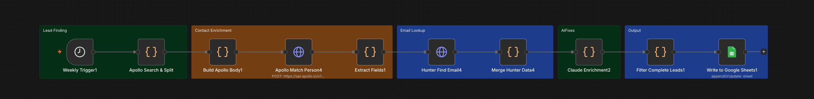

# Opal — AI Lead Enrichment Pipeline Template

> A fully automated framework for finding, enriching, scoring, and logging leads — powered by AI and built on n8n. Zero manual input required.

---

## What This Template Does

Opal is a set-it-and-forget-it lead pipeline. Once activated, it runs every week on its own — finding fresh leads, researching them with AI, scoring them, and writing the results to a Google Sheet. You never touch the workflow between runs.

1. Searches for new leads based on filters you define (title, sector, location)
2. Finds any missing emails via Hunter.io
3. Sends each lead to Claude AI to research, summarize, and score them
4. Filters out any incomplete records
5. Appends clean, enriched rows to your Google Sheet

---

## Pipeline Architecture



```
[Weekly Trigger]
      │
      ▼
[Apollo Search & Split]     ← Pulls 10 fresh leads per week, auto-paginates
      │                       Returns name, title, org, LinkedIn, email, location
      ▼
[Hunter Find Email]         ← Finds or verifies email if Apollo didn't return one
      │
      ▼
[Merge Hunter Data]         ← Combines Apollo + Hunter into one clean record
      │
      ▼
[Claude AI Enrichment]      ← Researches each lead, returns scored JSON
      │
      ▼
[Filter Complete Leads]     ← Drops any record missing name, org, LinkedIn, or email
      │
      ▼
[Write to Google Sheets]    ← Appends or updates rows matched on Investment Group Name
```

---

## Customizing the Search Filters

Open the `Apollo Search & Split` node and edit these values to match your target:

```js
body: {
  q_keywords: 'angel investor fintech crypto',       // ← your keywords
  person_titles: ['angel investor', 'investor'],     // ← target titles
  person_locations: ['United States'],               // ← target geography
  per_page: 10,                                      // ← leads per week
  page: page                                         // ← auto-calculated, don't touch
}
```

Examples:
- For SaaS sales: `q_keywords: 'VP Sales SaaS'`, `person_titles: ['VP of Sales', 'Head of Sales']`
- For recruiting: `q_keywords: 'senior engineer react'`, `person_locations: ['San Francisco, CA']`
- For partnerships: `q_keywords: 'partnerships director fintech'`

---

## What Claude Returns Per Lead

The AI enrichment step researches each person and returns a structured JSON object. Every field maps directly to a column in your Google Sheet.

| Field | Description |
|---|---|
| `correctedTitle` | Cleaned, accurate job title |
| `confirmedAngel` | Whether they do personal angel investing |
| `fundSize` | Known AUM or fund size |
| `avgCheckSize` | Typical check size range |
| `stageFocus` | Pre-seed, Seed, Series A, etc. |
| `sectorFocus` | Fintech, Crypto, SaaS, Consumer, etc. |
| `recentActivity` | Active in last 1–2 years (Yes / No) |
| `reachable` | Estimated under 10K LinkedIn followers |
| `fitScore` | Tier 1 or Tier 2 match for your criteria |
| `note` | One-sentence fit summary |

To change what Claude scores for, edit the prompt inside the `Claude Enrichment` node.

---

## Cost Estimates

### Per-Lead Cost

| Service | Role | Cost Per Lead |
|---|---|---|
| Apollo.io | Lead search + contact data | ~$0.00–$0.10 |
| Hunter.io | Email verification | ~$0.00–$0.01 |
| Claude API | AI research and scoring | ~$0.007 |
| Google Sheets | Output logging | Free |

### Monthly Total by Volume

| Leads Per Week | Claude API | Apollo + Hunter | n8n Cloud | Est. Monthly |
|---|---|---|---|---|
| 10 | ~$0.28 | Free tier | $20 | **~$20** |
| 40 | ~$1.12 | Free tier | $20 | **~$21** |
| 100 | ~$2.80 | $49 | $20 | **~$72** |
| 500 | ~$14.00 | $99 | $50 | **~$163** |

---

## Setup

1. Import `opal_pipeline_v3.json` into n8n via *Import from File*
2. Connect your Google Sheets OAuth2 credential and paste your Sheet ID into the `Write to Google Sheets` node
3. Add your API keys:
   - Apollo key → `Apollo Search & Split` node
   - Hunter key → `Hunter Find Email` node
   - Anthropic key → `Claude Enrichment` node
4. Edit the search filters in `Apollo Search & Split` to match your target persona
5. Run a manual test — you should see 10 leads flow through end to end
6. Activate — the workflow runs every Monday at 9 AM automatically

---

## Adapting to a New Use Case

Change the Apollo search filters and the Claude scoring prompt — everything else stays the same.

| Use Case | Apollo Filters | Claude Prompt Change |
|---|---|---|
| Investor outreach | `angel investor`, `venture capitalist` | Score by fintech/crypto fit |
| Sales prospecting | `VP Sales`, `Head of Revenue` | Score by company size, budget signals |
| Recruiting | `Senior Engineer`, `Staff Engineer` | Score by skills match |
| Partnerships | `Head of Partnerships`, `BD Director` | Score by sector alignment |

---

## Tech Stack

| Tool | Role |
|---|---|
| [n8n](https://n8n.io) | Workflow automation |
| [Apollo.io](https://apollo.io) | Lead search and contact data |
| [Hunter.io](https://hunter.io) | Email verification |
| [Claude API](https://anthropic.com) | AI research and scoring |
| [Google Sheets](https://sheets.google.com) | Output and logging |

---
